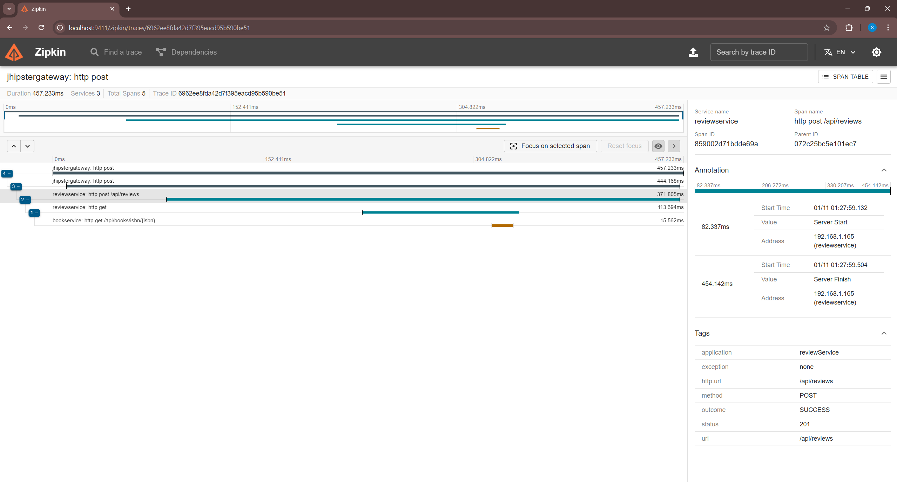
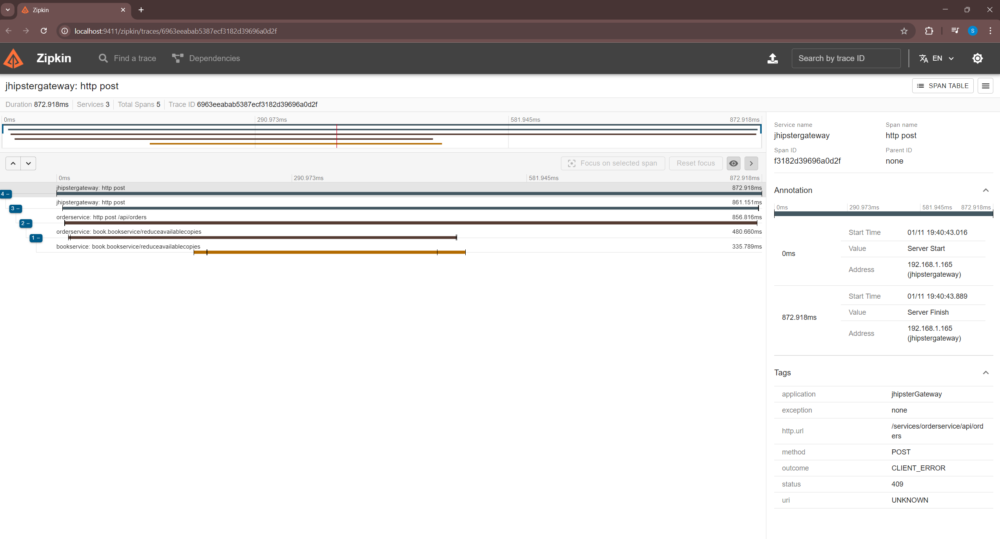

# 📚 Bookstore Microservice System

This is a microservice-based system for managing books and their reviews and orders, built using Spring Boot. It demonstrates robust inter-service communication using **Feign Clients** (REST), **gRPC**, and **Kafka** with **distributed tracing** implemented via Micrometer and Zipkin for end-to-end observability across all services.

## 🏗️ Architecture Overview

This project follows a microservices architecture with the following core services:

- **Registry Service** – For service discovery.
- **Gateway Service** – To route and secure external requests.
- **Book Service** – Manages book data.
- **Review Service** – Handles user reviews for books.
- **Order Service** – Handles user orders for books.

Services communicate via:

- 🧩 **Feign Client** (HTTP-based calls)
- ⚡ **gRPC** (for performant binary communication)
- 📨 **Kafka** (for asynchronous event-driven messaging)

## 🤝 Feign Client Integration (Review Service → Book Service)

To enable inter-service communication between Review Service and Book Service, we use Spring Cloud OpenFeign, a declarative REST client. This allows the Review Service to fetch book details (e.g., by ISBN) from the Book Service to validate the book before saving a review.

### ⚙️ Setup with JHipster

When generating your microservice with JHipster, make sure to enable Feign client support:

> **Prompt:** > _"Do you want to generate a Feign client?"_
> Answer: Yes

This scaffolds the required dependencies and base configuration for Feign in your microservice.

### 🧩 Review Service Integration Steps

To achieve this integration in the review service you need to follow the following steps

#### 🔗 Step 1: Define the Feign Client Interface

In your review service you need to create a BookServiceClient interface that acts as a proxy for calling the Book Service

```java
## src/main/java/com/prunny/reviewservice/client/BookServiceClient

@FeignClient(name = "bookservice")
public interface BookServiceClient {
    @GetMapping("/api/books/isbn/{isbn}")
    BookDTO getBookByIsbn(@PathVariable("isbn") String isbn);
}
```

#### 🔐 Step 2: Secure Feign Requests with Internal JWT

Since the Book Service is protected by Spring Security, the Review Service must authenticate itself when making requests. To achieve secure inter-service communication, we configure a Feign interceptor to generate and attach a JWT token to each outgoing request.

```java
## src/main/java/com/prunny/reviewservice/client/UserFeignClientInterceptor.java

@Component
public class UserFeignClientInterceptor implements RequestInterceptor {

    private static final String BASE64_SECRET = "<YOUR_BASE64_ENCODED_SECRET>";

    @Override
    public void apply(RequestTemplate template) {
        String internalJwt = generateInternalJwt();
        template.header("Authorization", "Bearer " + internalJwt);
    }

    private String generateInternalJwt() {
        byte[] keyBytes = Base64.getDecoder().decode(BASE64_SECRET);
        SecretKey key = new SecretKeySpec(keyBytes, 0, keyBytes.length, "HmacSHA512");

        return Jwts.builder()
            .claim("auth", List.of("INTERNAL_ADMIN"))
            .setSubject("review-service")
            .setIssuedAt(new Date())
            .setExpiration(Date.from(Instant.now().plus(Duration.ofHours(1))))
            .signWith(key, SignatureAlgorithm.HS512)
            .compact();
    }
}
```

This approach eliminates the need for user context or SecurityContextHolder, making it ideal for background tasks, scheduled jobs, or service-to-service communication in microservices.

> **Note:** Make sure the BASE64_SECRET matches the secret configured in your Book Service's JWT decoder setup.

#### ⚙️ Step 3: Configure Feign to Use the JWT Interceptor

To wire up the Feign client and ensure that all outgoing HTTP requests from the Review Service to the Book Service include the internally generated JWT token, we define a centralized Feign configuration class.

```java
## src/main/java/com/prunny/reviewservice/config/FeignConfiguration.java

@Configuration
@EnableFeignClients(basePackages = "com.prunny.reviewservice")
@Import(FeignClientsConfiguration.class)
public class FeignConfiguration {

    @Bean
    feign.Logger.Level feignLoggerLevel() {
        return feign.Logger.Level.BASIC;
    }

    @Bean
    public RequestInterceptor requestInterceptor() {
        return new UserFeignClientInterceptor();
    }
}
```

#### 📡 Step 4: Use the Feign Client to Fetch Book Data Inside Your Service Logic

After configuring the Feign client and interceptor, the next step is to leverage it in your service layer—in this case, inside the ReviewService—to fetch book details from the Book Service before saving a review.

```java
## src/main/java/com/prunny/reviewservice/service/ReviewService.java

public ReviewDTO save(ReviewDTO reviewDTO) {
    LOG.debug("Request to save Review : {}", reviewDTO);
    BookDTO bookDTO = bookServiceClient.getBookByIsbn(reviewDTO.getBookIsbn());
    System.out.println("Book Details " + bookDTO);
    Review review = reviewMapper.toEntity(reviewDTO);
    review = reviewRepository.save(review);
    return reviewMapper.toDto(review);
}
```

#### 🛡️ Step 5: Gracefully Handle Feign Client Errors with a Global Exception Handler

When making remote calls using Feign (e.g., to the Book Service), failures such as 404 Not Found, 403 Forbidden, or 500 Internal Server Error can occur. To avoid leaking raw Feign exception details and to provide a clean, user-friendly API response, we handle these errors centrally using a global exception handler.

```java
## src/main/java/com/prunny/reviewservice/exception/GlobalExceptionHandler.java

@ExceptionHandler(FeignException.class)
public ResponseEntity<ApiResponse> handleFeignException(FeignException ex) {
    String message = "Remote service error";

    try {
        if (ex.content() != null) {
            JsonNode root = objectMapper.readTree(ex.contentUTF8());

            message = root.path("detail").asText();
            if (message == null || message.isBlank()) {
                message = root.path("message").asText("Remote service error");
            }
        }
    } catch (Exception e) {
        message = "Error parsing remote service response";
    }

    ApiResponse apiResponse = new ApiResponse(message, null);
    return ResponseEntity.status(ex.status()).body(apiResponse);
}
```

## ⚡ gRPC Integration (Order Service → Book Service)

To enable high-performance inter-service communication between the Order Service and Book Service, we integrate gRPC — a modern, efficient Remote Procedure Call (RPC) framework. This allows the Order Service to query book availability, pricing, or metadata in real time before confirming or processing an order.

### ⚙️ Setup with JHipster and gRPC

JHipster doesn’t include gRPC support out of the box, but you can manually set it up by adding grpc dependencies

Add the following to the `<dependencies>` section

```xml
## pom.xl

<!--GRPC -->
<dependency>
    <groupId>io.grpc</groupId>
    <artifactId>grpc-netty-shaded</artifactId>
    <version>1.69.0</version>
</dependency>
<dependency>
    <groupId>io.grpc</groupId>
    <artifactId>grpc-protobuf</artifactId>
    <version>1.69.0</version>
</dependency>
<dependency>
    <groupId>io.grpc</groupId>
    <artifactId>grpc-stub</artifactId>
    <version>1.69.0</version>
</dependency>
<dependency> <!-- necessary for Java 9+ -->
    <groupId>org.apache.tomcat</groupId>
    <artifactId>annotations-api</artifactId>
    <version>6.0.53</version>
    <scope>provided</scope>
</dependency>
<dependency>
    <groupId>net.devh</groupId>
    <artifactId>grpc-spring-boot-starter</artifactId>
    <version>3.1.0.RELEASE</version>
</dependency>
<dependency>
    <groupId>com.google.protobuf</groupId>
    <artifactId>protobuf-java</artifactId>
    <version>4.29.1</version>
</dependency>
```

Add the following to the `<build>` section

```xml
## pom.xl

<build>
    <extensions>
        <!-- Ensure OS compatibility for protoc -->
        <extension>
            <groupId>kr.motd.maven</groupId>
            <artifactId>os-maven-plugin</artifactId>
            <version>1.7.0</version>
        </extension>
    </extensions>
    <plugins>
        <!-- Spring boot / maven  -->
        <plugin>
            <groupId>org.springframework.boot</groupId>
            <artifactId>spring-boot-maven-plugin</artifactId>
        </plugin>

        <!-- PROTO -->
        <plugin>
            <groupId>org.xolstice.maven.plugins</groupId>
            <artifactId>protobuf-maven-plugin</artifactId>
            <version>0.6.1</version>
            <configuration>
                <protocArtifact>com.google.protobuf:protoc:3.25.5:exe:${os.detected.classifier}</protocArtifact>
                <pluginId>grpc-java</pluginId>
                <pluginArtifact>io.grpc:protoc-gen-grpc-java:1.68.1:exe:${os.detected.classifier}</pluginArtifact>
            </configuration>
            <executions>
                <execution>
                    <goals>
                        <goal>compile</goal>
                        <goal>compile-custom</goal>
                    </goals>
                    <configuration>
                        <sources>
                          <source>${project.build.directory}/generated-sources/protobuf/java</source>
                          <source>${project.build.directory}/generated-sources/protobuf/grpc-java</source>
                        </sources>
                    </configuration>
                </execution>
            </executions>
        </plugin>
        <plugin>
            <groupId>org.codehaus.mojo</groupId>
            <artifactId>build-helper-maven-plugin</artifactId>
            <version>3.2.0</version>
            <executions>
                <execution>
                    <id>add-source</id>
                    <phase>generate-sources</phase>
                    <goals>
                        <goal>add-source</goal>
                    </goals>
                    <configuration>
                        <sources>
                            <source>${project.build.directory}/generated-sources/protobuf/java</source>
                            <source>${project.build.directory}/generated-sources/protobuf/grpc-java</source>
                        </sources>
                    </configuration>
                </execution>
            </executions>
    </plugin>

    </plugins>
</build>
```

#### 📦 Step 1: Define a Shared Proto File

We create a `book_service.proto` file that defines the service contract between the Book and Order services.

```java
## src/main/proto/book_service.proto

syntax = "proto3";

option java_multiple_files = true;
option java_package = "book";

package book;

service BookService {
  rpc ReduceAvailableCopies (ReduceAvailableCopiesRequest) returns (ReduceAvailableCopiesResponse);
}

message ReduceAvailableCopiesRequest {
  string bookIsbn = 1;
  int32 quantity = 2;
}

message ReduceAvailableCopiesResponse {
  bool success = 1;
  string message = 2;
}
```

> **Note:** For ease of development and configuration, especially in early-stage projects or proof-of-concept builds, we place the .proto file directly under src/main/proto/ in both the Book and Order services.

> In a real-world microservices architecture, it's best practice to centralize proto definitions in a shared repository or internal package registry. This ensures consistency across services and prevents duplication or contract drift.

##### Alternative (Recommended in Teams): Use Precompiled .proto JARs

If your team is managing the shared protos, they can:

1. Generate the Java stubs from the .proto files once
2. Package and publish them as a library to a private Maven or GitHub Packages registry, e.g., book-proto-stubs
3. You just consume the precompiled stubs:

```bash
<dependency>
    <groupId>com.prunny.shared</groupId>
    <artifactId>book-proto-stubs</artifactId>
    <version>1.0.0</version>
</dependency>
```

#### 🔁 Step 2: Generate gRPC Stubs

To generate the Java classes (stubs) from the .proto file, run:

```bash
mvn clean install
```

- This will generate the required gRPC files (e.g., BookServiceGrpc.java, BookRequest.java, etc.) into:

```bash
target/generated-sources/protobuf/
```

- In IntelliJ (or your IDE), you must mark this directory as a "Source Root" so the generated stubs can be used in your codebase:
  Right-click → Mark Directory as → Generated Sources Root

#### 🧩 Step 3: Implement the gRPC Server in Book Service

```java
## src/main/java/com/prunny/book_service/grpc/server/BookGrpcService.java

@GrpcService
public class BookGrpcService extends BookServiceGrpc.BookServiceImplBase {
    private static final Logger log = LoggerFactory.getLogger(BookGrpcService.class);

    private final BookRepository bookRepository;

    public BookGrpcService(BookRepository bookRepository) {
        this.bookRepository = bookRepository;
    }

    @Override
    public void reduceAvailableCopies(book.ReduceAvailableCopiesRequest request, StreamObserver<book.ReduceAvailableCopiesResponse> responseObserver) {
        log.info("ReduceAvailableCopies request received {}", request.toString());

        try {
            Optional<Book> bookOptional = bookRepository.findByIsbn(request.getBookIsbn());
            if (bookOptional.isEmpty()) {
                ReduceAvailableCopiesResponse response = ReduceAvailableCopiesResponse.newBuilder()
                    .setSuccess(false)
                    .setMessage("Book not found")
                    .build();
                responseObserver.onNext(response);
                responseObserver.onCompleted();
                return;
            }

            Book book = bookOptional.get();
            if (book.getAvailableCopies() < request.getQuantity()) {
                ReduceAvailableCopiesResponse response = ReduceAvailableCopiesResponse.newBuilder()
                    .setSuccess(false)
                    .setMessage("Not enough stock")
                    .build();
                responseObserver.onNext(response);
                responseObserver.onCompleted();
                return;
            }

            book.setAvailableCopies(book.getAvailableCopies() - request.getQuantity());
            bookRepository.save(book);

            ReduceAvailableCopiesResponse response = ReduceAvailableCopiesResponse.newBuilder()
                .setSuccess(true)
                .setMessage("Successfully reduced available copies of book")
                .build();
            responseObserver.onNext(response);
            responseObserver.onCompleted();

        } catch (Exception e) {
            log.error("Error while reducing available copies", e);
            responseObserver.onError(
                Status.INTERNAL
                    .withDescription("Unexpected error occurred")
                    .withCause(e)
                    .asRuntimeException()
            );
        }
    }

}
```

#### 🚀 Step 4: Create the gRPC Client in Order Service

```java
@Service
public class BookServiceGrpcClient {
    private static final Logger log = LoggerFactory.getLogger(BookServiceGrpcClient.class);
    private final BookServiceGrpc.BookServiceBlockingStub blockingStub;

    public BookServiceGrpcClient(
        @Value("${book.service.address:localhost}") String serverAddress,
        @Value("${book.service.grpc.port:9090}") int serverPort
    ) {
        log.info("Connecting to Billing Service GRPC service at {}:{}", serverAddress, serverPort);

        ManagedChannel channel = NettyChannelBuilder
            .forAddress(serverAddress, serverPort)
            .usePlaintext()
            .build();

        blockingStub = BookServiceGrpc.newBlockingStub(channel);
    }

    public ReduceAvailableCopiesResponse reduceAvailableCopies(String bookIsbn, int quantity) {
        ReduceAvailableCopiesRequest request = ReduceAvailableCopiesRequest.newBuilder().setBookIsbn(bookIsbn).setQuantity(quantity).build();

        ReduceAvailableCopiesResponse response = blockingStub.reduceAvailableCopies(request);

        return response;
    }
}
```

#### 📡 Step 5: Use gRPC Client in Order Service to validate Book availability

```java
public OrderDTO save(OrderDTO orderDTO) {
        LOG.debug("Request to save Order : {}", orderDTO);
        Order order = orderMapper.toEntity(orderDTO);
        order = orderRepository.save(order);

        ReduceAvailableCopiesResponse bookServiceResponse = bookServiceGrpcClient.reduceAvailableCopies(order.getBookIsbn(), order.getQuantity());
        LOG.info("Received response from book service via GRPC: {}", bookServiceResponse);
        if (!bookServiceResponse.getSuccess()) {
            String msg = bookServiceResponse.getMessage().toLowerCase();
            if (msg.contains("not found")) throw new ResourceNotFoundException(msg);
            if (msg.contains("not enough stock")) throw new InsufficientStockException(msg);
            throw new ResourceNotFoundException(bookServiceResponse.getMessage());
        }

        return orderMapper.toDto(order);
    }
```

## 📨 Kafka Event-Driven Integration (Order Service → Book Service)

To enable asynchronous, event-driven communication between the Order Service and Book Service, we integrate Apache Kafka. This allows the Order Service to publish events when books are ordered, which the Book Service consumes to update sales metrics in real time without blocking the order flow.

### 🏗️ Kafka Architecture Overview

The event-driven flow works as follows:

1. **Order Service** (Producer) publishes a `BookOrderedEvent` to Kafka after successfully creating an order
2. **Kafka** stores the event in the `book.order.created` topic
3. **Book Service** (Consumer) receives the event and increments the book's sales count
4. **Schema Registry** ensures both services use compatible Protobuf schemas

This decoupled approach provides resilience, scalability, and eliminates tight coupling between services.

### 🐳 Kafka Infrastructure Setup

We run Kafka in KRaft mode (without ZooKeeper) using Docker Compose with three core components:

- **Kafka Broker** - Message storage and distribution
- **Schema Registry** - Protobuf schema management and validation
- **Kafka UI** - Web interface for monitoring topics and messages

#### Docker Compose Configuration

```yaml
## kafka.yml

name: kafka-setup

services:
  kafka:
    image: confluentinc/cp-kafka:8.1.1
    hostname: kafka
    container_name: kafka
    ports:
      - "9092:9092"
    environment:
      # KRaft mode configuration
      KAFKA_NODE_ID: 1
      KAFKA_PROCESS_ROLES: "broker,controller"
      KAFKA_CONTROLLER_QUORUM_VOTERS: "1@kafka:29093"

      # Listener configuration
      KAFKA_LISTENERS: "PLAINTEXT://0.0.0.0:29092,PLAINTEXT_HOST://0.0.0.0:9092,CONTROLLER://0.0.0.0:29093"
      KAFKA_ADVERTISED_LISTENERS: "PLAINTEXT://kafka:29092,PLAINTEXT_HOST://localhost:9092"
      KAFKA_LISTENER_SECURITY_PROTOCOL_MAP: "PLAINTEXT:PLAINTEXT,PLAINTEXT_HOST:PLAINTEXT,CONTROLLER:PLAINTEXT"
      KAFKA_CONTROLLER_LISTENER_NAMES: "CONTROLLER"
      KAFKA_INTER_BROKER_LISTENER_NAME: "PLAINTEXT"

      # Development settings
      KAFKA_OFFSETS_TOPIC_REPLICATION_FACTOR: 1
      KAFKA_TRANSACTION_STATE_LOG_REPLICATION_FACTOR: 1
      KAFKA_TRANSACTION_STATE_LOG_MIN_ISR: 1
      KAFKA_GROUP_INITIAL_REBALANCE_DELAY_MS: 0

      # KRaft storage
      CLUSTER_ID: "MkU3OEVBNTcwNTJENDM2Qk"
      KAFKA_LOG_DIRS: "/var/lib/kafka/data"

  schema-registry:
    image: confluentinc/cp-schema-registry:8.1.1
    hostname: schema-registry
    container_name: schema-registry
    depends_on:
      - kafka
    ports:
      - "8091:8081"
    environment:
      SCHEMA_REGISTRY_HOST_NAME: schema-registry
      SCHEMA_REGISTRY_LISTENERS: "http://0.0.0.0:8081"
      SCHEMA_REGISTRY_KAFKASTORE_BOOTSTRAP_SERVERS: "PLAINTEXT://kafka:29092"

  kafka-ui:
    image: provectuslabs/kafka-ui:latest
    depends_on:
      - kafka
      - schema-registry
    ports:
      - "8090:8080"
    environment:
      KAFKA_CLUSTERS_0_NAME: local
      KAFKA_CLUSTERS_0_BOOTSTRAPSERVERS: "kafka:29092"
      KAFKA_CLUSTERS_0_SCHEMAREGISTRY: "http://schema-registry:8081"
```

**Key Configuration Points:**

- **Port 9092** - External access for Spring applications running on host machine
- **Port 29092** - Internal container-to-container communication
- **Port 8091** - Schema Registry HTTP endpoint
- **Port 8090** - Kafka UI web interface

Start the infrastructure:

```bash
docker-compose -f kafka.yml up -d
```

### 📦 Maven Dependencies

Both Order Service and Book Service require these dependencies:

```xml
## pom.xml
<dependencies>
    <!-- Protobuf - For message serialization used by both grpc and kafka -->
    <dependency>
        <groupId>com.google.protobuf</groupId>
        <artifactId>protobuf-java</artifactId>
        <version>4.31.1</version>
    </dependency>

    <!-- Spring Kafka - High-level Kafka integration -->
    <dependency>
        <groupId>org.springframework.kafka</groupId>
        <artifactId>spring-kafka</artifactId>
    </dependency>

    <!-- Confluent Protobuf Serializer - Converts Protobuf to bytes for Kafka -->
    <dependency>
        <groupId>io.confluent</groupId>
        <artifactId>kafka-protobuf-serializer</artifactId>
        <version>8.1.1</version>
    </dependency>
</dependencies>

```

#### Protobuf Maven Plugin

```xml
## pom.xml (build section)
<!-- PROTO -->
<plugin>
    <groupId>org.xolstice.maven.plugins</groupId>
    <artifactId>protobuf-maven-plugin</artifactId>
    <version>0.6.1</version>
    <configuration>
        <protocArtifact>com.google.protobuf:protoc:4.31.1:exe:${os.detected.classifier}</protocArtifact>
        <pluginId>grpc-java</pluginId>
      <pluginArtifact>io.grpc:protoc-gen-grpc-java:1.69.0:exe:${os.detected.classifier}</pluginArtifact>
    </configuration>
    <executions>
        <execution>
            <goals>
                <goal>compile</goal>
                <goal>compile-custom</goal>
            </goals>
      </execution>
    </executions>
</plugin>
```

### 🧩 Kafka Integration Steps

#### 📋 Step 1: Define Event Schema

Create a shared Protobuf schema for the book order event:

```protobuf
## src/main/proto/book_events.proto

syntax = "proto3";

option java_multiple_files = true;
option java_package = "com.bookstore.events";

package bookstore.events;

import "google/protobuf/timestamp.proto";

message BookOrderedEvent {
    string event_id = 1;
    string order_id = 2;
    string book_isbn = 3;
    int32 quantity = 4;
    google.protobuf.Timestamp ordered_at = 5;
}
```

Generate Java classes:

```bash
mvn clean install
```

Mark `target/generated-sources/protobuf/` as a source root in your IDE.

#### 📤 Step 2: Configure Producer in Order Service

##### Application Configuration

```yaml
## application.yml (Order Service)

spring:
  kafka:
    bootstrap-servers: localhost:9092
    producer:
      key-serializer: org.apache.kafka.common.serialization.StringSerializer
      value-serializer: io.confluent.kafka.serializers.protobuf.KafkaProtobufSerializer
      acks: all
      retries: 3
    properties:
      enable.idempotence: true
      schema.registry.url: http://localhost:8091

bookstore:
  kafka:
    topics:
      book-ordered: book.order.created
```

**Configuration Breakdown:**

- `acks: all` - Wait for all replicas to confirm receipt (strongest durability)
- `retries: 3` - Retry failed sends up to 3 times
- `enable.idempotence: true` - Prevent duplicate messages on retry

##### Producer Configuration Class

```java
## src/main/java/com/prunny/order_service/config/KafkaProducerConfig.java

@Configuration
public class KafkaProducerConfig {

    @Value("${spring.kafka.bootstrap-servers}")
    private String bootstrapServers;

    @Value("${spring.kafka.properties.schema.registry.url}")
    private String schemaRegistryUrl;

    @Bean
    public ProducerFactory producerFactory() {
        Map config = new HashMap<>();

        config.put(ProducerConfig.BOOTSTRAP_SERVERS_CONFIG, bootstrapServers);
        config.put(ProducerConfig.KEY_SERIALIZER_CLASS_CONFIG, StringSerializer.class);
        config.put(ProducerConfig.VALUE_SERIALIZER_CLASS_CONFIG, KafkaProtobufSerializer.class);
        config.put(ProducerConfig.ACKS_CONFIG, "all");
        config.put(ProducerConfig.RETRIES_CONFIG, 3);
        config.put(ProducerConfig.ENABLE_IDEMPOTENCE_CONFIG, true);
        config.put(KafkaProtobufSerializerConfig.SCHEMA_REGISTRY_URL_CONFIG, schemaRegistryUrl);

        return new DefaultKafkaProducerFactory<>(config);
    }

    @Bean
    public KafkaTemplate kafkaTemplate() {
        return new KafkaTemplate<>(producerFactory());
    }
}
```

#### 📡 Step 3: Implement Event Publisher

```java
## src/main/java/com/prunny/order_service/service/BookEventPublisher.java

@Service
public class BookEventPublisher {

    private static final Logger LOG = LoggerFactory.getLogger(BookEventPublisher.class);

    private final KafkaTemplate kafkaTemplate;
    private final String topicName;

    public BookEventPublisher(
        KafkaTemplate kafkaTemplate,
        @Value("${bookstore.kafka.topics.book-ordered}") String topicName)
    {
        this.kafkaTemplate = kafkaTemplate;
        this.topicName = topicName;
    }

    public void publishBookOrderedEvent(String orderId, String bookIsbn, Integer quantity) {
        Instant now = Instant.now();
        BookOrderedEvent event = BookOrderedEvent.newBuilder()
            .setEventId(UUID.randomUUID().toString())
            .setOrderId(orderId)
            .setBookIsbn(bookIsbn)
            .setQuantity(quantity)
            .setOrderedAt(Timestamp.newBuilder()
                .setSeconds(now.getEpochSecond())
                .setNanos(now.getNano())
                .build())
            .build();

        LOG.info("Publishing BookOrderedEvent: orderId={}, bookIsbn={}, quantity={}",
            orderId, bookIsbn, quantity);

        CompletableFuture<SendResult> future =
            kafkaTemplate.send(topicName, bookIsbn, event);

        future.whenComplete((result, ex) -> {
            if (ex == null) {
                LOG.info("Successfully published event: eventId={}, partition={}, offset={}",
                    event.getEventId(),
                    result.getRecordMetadata().partition(),
                    result.getRecordMetadata().offset());
            } else {
                LOG.error("Failed to publish event: eventId={}, error={}",
                    event.getEventId(), ex.getMessage(), ex);
            }
        });
    }
}
```

**Key Design Decisions:**

- **Message Key** - Uses `bookIsbn` as the partition key to ensure all events for the same book go to the same partition, maintaining order
- **Async Publishing** - Uses `CompletableFuture` for non-blocking operation
- **Event ID** - UUID for idempotency tracking and deduplication

#### 🔗 Step 4: Integrate Publisher in Order Service

```java
## src/main/java/com/prunny/order_service/service/OrderService.java

public OrderDTO save(OrderDTO orderDTO) {
    LOG.debug("Request to save Order : {}", orderDTO);
    Order order = orderMapper.toEntity(orderDTO);
    order = orderRepository.save(order);

    // Synchronous gRPC call to reduce inventory
    ReduceAvailableCopiesResponse bookServiceResponse = 
        bookServiceGrpcClient.reduceAvailableCopies(order.getBookIsbn(), order.getQuantity());
    
    LOG.info("Received response from book service via GRPC: {}", bookServiceResponse);
    
    if (!bookServiceResponse.getSuccess()) {
        String msg = bookServiceResponse.getMessage().toLowerCase();
        if (msg.contains("not found")) throw new ResourceNotFoundException(msg);
        if (msg.contains("not enough stock")) throw new InsufficientStockException(msg);
        throw new ResourceNotFoundException(bookServiceResponse.getMessage());
    }

    // Asynchronous Kafka event for analytics
    bookEventPublisher.publishBookOrderedEvent(
        order.getId().toString(),
        order.getBookIsbn(),
        order.getQuantity()
    );

    return orderMapper.toDto(order);
}
```

#### 📥 Step 5: Configure Consumer in Book Service

##### Application Configuration

```yaml
## application.yml (Book Service)

spring:
  kafka:
    bootstrap-servers: localhost:9092
    consumer:
      group-id: book-service-sales-updater
      key-deserializer: org.apache.kafka.common.serialization.StringDeserializer
      value-deserializer: io.confluent.kafka.serializers.protobuf.KafkaProtobufDeserializer
      auto-offset-reset: earliest
      enable-auto-commit: false
    properties:
      specific.protobuf.value.type: com.bookstore.events.BookOrderedEvent
      schema.registry.url: http://localhost:8091
    listener:
      ack-mode: manual

bookstore:
  kafka:
    topics:
      book-ordered: book.order.created
```

**Configuration Breakdown:**

- `group-id` - Consumer group name for load balancing across multiple instances
- `auto-offset-reset: earliest` - Start from beginning if no previous offset exists
- `enable-auto-commit: false` - Manual offset management for reliability
- `ack-mode: manual` - Only commit offset after successful processing

##### Consumer Configuration Class

```java
## src/main/java/com/prunny/book_service/config/KafkaConsumerConfig.java

@EnableKafka
@Configuration
public class KafkaConsumerConfig {

    @Value("${spring.kafka.bootstrap-servers}")
    private String bootstrapServers;

    @Value("${spring.kafka.consumer.group-id}")
    private String groupId;

    @Value("${spring.kafka.properties.schema.registry.url}")
    private String schemaRegistryUrl;

    @Bean
    public ConsumerFactory consumerFactory() {
        Map config = new HashMap<>();

        config.put(ConsumerConfig.BOOTSTRAP_SERVERS_CONFIG, bootstrapServers);
        config.put(ConsumerConfig.GROUP_ID_CONFIG, groupId);
        config.put(ConsumerConfig.KEY_DESERIALIZER_CLASS_CONFIG, StringDeserializer.class);
        config.put(ConsumerConfig.VALUE_DESERIALIZER_CLASS_CONFIG, KafkaProtobufDeserializer.class);
        config.put(ConsumerConfig.AUTO_OFFSET_RESET_CONFIG, "earliest");
        config.put(ConsumerConfig.ENABLE_AUTO_COMMIT_CONFIG, false);
        config.put(KafkaProtobufDeserializerConfig.SCHEMA_REGISTRY_URL_CONFIG, schemaRegistryUrl);
        config.put(KafkaProtobufDeserializerConfig.SPECIFIC_PROTOBUF_VALUE_TYPE,
            BookOrderedEvent.class.getName());

        return new DefaultKafkaConsumerFactory<>(config);
    }

    @Bean
    public ConcurrentKafkaListenerContainerFactory
    kafkaListenerContainerFactory() {

        ConcurrentKafkaListenerContainerFactory factory =
            new ConcurrentKafkaListenerContainerFactory<>();

        factory.setConsumerFactory(consumerFactory());
        factory.getContainerProperties().setAckMode(ContainerProperties.AckMode.MANUAL);

        return factory;
    }
}
```

#### 🎧 Step 6: Implement Event Listener

```java
## src/main/java/com/prunny/book_service/service/BookEventListener.java

@Service
public class BookEventListener {

    private static final Logger LOG = LoggerFactory.getLogger(BookEventListener.class);

    private final BookService bookService;
    private final EventIdempotencyService eventIdempotencyService;

    public BookEventListener(BookService bookService, 
                           EventIdempotencyService eventIdempotencyService) {
        this.bookService = bookService;
        this.eventIdempotencyService = eventIdempotencyService;
    }

    @KafkaListener(
        topics = "${bookstore.kafka.topics.book-ordered}",
        groupId = "${spring.kafka.consumer.group-id}"
    )
    public void handleBookOrderedEvent(
        @Payload BookOrderedEvent event,
        @Header(KafkaHeaders.RECEIVED_PARTITION) int partition,
        @Header(KafkaHeaders.OFFSET) long offset,
        Acknowledgment acknowledgment) {

        try {
            LOG.info("Received BookOrderedEvent: eventId={}, orderId={}, bookIsbn={}, quantity={}, partition={}, offset={}",
                event.getEventId(), event.getOrderId(), event.getBookIsbn(), 
                event.getQuantity(), partition, offset);

            // Idempotency check
            if (eventIdempotencyService.isEventProcessed(event.getEventId())) {
                LOG.warn("Event already processed, skipping: eventId={}", event.getEventId());
                acknowledgment.acknowledge();
                return;
            }

            // Process event
            bookService.incrementSalesCount(event.getBookIsbn(), event.getQuantity());

            // Mark as processed
            eventIdempotencyService.markEventAsProcessed(event.getEventId());

            // Commit offset
            acknowledgment.acknowledge();

            LOG.info("Successfully processed BookOrderedEvent: eventId={}", event.getEventId());

        } catch (Exception ex) {
            LOG.error("Error processing BookOrderedEvent: eventId={}, error={}",
                event.getEventId(), ex.getMessage(), ex);
            
            // Don't acknowledge - Kafka will redeliver
            throw ex;
        }
    }
}
```

**Processing Guarantees:**

- **Idempotency** - Tracks processed event IDs to prevent duplicate processing
- **At-least-once delivery** - Events are redelivered on failure
- **Manual acknowledgment** - Offset committed only after successful processing

#### 🛡️ Step 7: Implement Idempotency Service

To ensure events are processed exactly once, we implement a database-backed idempotency service that tracks processed event IDs.

##### Create the Entity

```java
## src/main/java/com/prunny/book_service/domain/ProcessedEvent.java

@Entity
@Table(name = "processed_event")
public class ProcessedEvent implements Serializable {

    @Id
    @GeneratedValue(strategy = GenerationType.SEQUENCE, generator = "sequenceGenerator")
    @SequenceGenerator(name = "sequenceGenerator")
    private Long id;

    @Column(name = "event_id", nullable = false, unique = true)
    private String eventId;  // The UUID from BookOrderedEvent

    @Column(name = "processed_at", nullable = false)
    private Instant processedAt;

    // Getters and setters
    public Long getId() { return id; }
    public void setId(Long id) { this.id = id; }

    public String getEventId() { return eventId; }
    public void setEventId(String eventId) { this.eventId = eventId; }

    public Instant getProcessedAt() { return processedAt; }
    public void setProcessedAt(Instant processedAt) { this.processedAt = processedAt; }
}
```

##### Create the Repository

```java
## src/main/java/com/prunny/book_service/repository/ProcessedEventRepository.java

@Repository
public interface ProcessedEventRepository extends JpaRepository {
    boolean existsByEventId(String eventId);
}
```

##### Implement the Service

```java
## src/main/java/com/prunny/book_service/service/EventIdempotencyService.java

@Service
public class EventIdempotencyService {

    private final ProcessedEventRepository processedEventRepository;

    public EventIdempotencyService(ProcessedEventRepository processedEventRepository) {
        this.processedEventRepository = processedEventRepository;
    }

    // Check if we've processed this event before
    @Transactional(readOnly = true)
    public boolean isEventProcessed(String eventId) {
        return processedEventRepository.existsByEventId(eventId);
    }

    // Mark this event as processed
    @Transactional
    public void markEventAsProcessed(String eventId) {
        ProcessedEvent processedEvent = new ProcessedEvent();
        processedEvent.setEventId(eventId);
        processedEvent.setProcessedAt(Instant.now());
        processedEventRepository.save(processedEvent);
    }
}
```

**Why Database-Backed Idempotency:**

- **Persistence** - Survives service restarts and deployments
- **Distributed Systems** - Works across multiple Book Service instances
- **Audit Trail** - Maintains a record of when events were processed
- **Unique Constraint** - Database ensures no duplicate event IDs can be inserted

### 🔍 Monitoring and Debugging

Access Kafka UI at `http://localhost:8090` to:

- View topics and partitions
- Inspect message content
- Monitor consumer lag
- Validate schema registry entries

### 🎯 Key Takeaways

**Architectural Benefits:**

- **Decoupling** - Order and Book services operate independently
- **Resilience** - Book Service downtime doesn't block order creation
- **Scalability** - Multiple Book Service instances can share the workload via consumer groups
- **Reliability** - Idempotent processing and manual offset management prevent data loss

**Message Flow:**

1. Order created → Event published to Kafka
2. Kafka persists event in `book.order.created` topic
3. Book Service consumes event
4. Idempotency check prevents duplicates
5. Sales count updated
6. Offset committed

This event-driven architecture complements the synchronous gRPC integration, using gRPC for critical real-time operations (inventory checks) and Kafka for eventual consistency workflows (analytics, metrics).


## 🔍 Distributed Tracing Implementation

This project implements distributed tracing for Feign client and gRPC inter-service calls using Micrometer and Zipkin.

### 🌐 Feign Client Tracing (Review → Book Service)

#### 📦 Maven Configuration

Add the Zipkin profile to your `pom.xml`

```xml
<profile>
    <id>zipkin</id>
    <dependencies>
        <dependency>
            <groupId>io.micrometer</groupId>
            <artifactId>micrometer-tracing</artifactId>
        </dependency>
        <dependency>
            <groupId>io.micrometer</groupId>
            <artifactId>micrometer-tracing-bridge-brave</artifactId>
        </dependency>
        <dependency>
            <groupId>io.zipkin.reporter2</groupId>
            <artifactId>zipkin-reporter-brave</artifactId>
        </dependency>
        <dependency>
            <groupId>io.github.openfeign</groupId>
            <artifactId>feign-micrometer</artifactId>
        </dependency>
    </dependencies>
</profile>
```

Spring Boot automatically configures tracing for RestTemplate, WebClient, and RestClient. Feign requires the additional `feign-micrometer` dependency and `spring.cloud.openfeign.micrometer.enabled=enable` properties in the calling service(Review service).

#### ⚙️ Application Configuration

Configure tracing in `application-dev.yml` for the Review Service:

```yml
spring:
  cloud:
    openfeign:
      micrometer:
        enabled: true

logging:
  pattern:
    level: "%5p [${spring.application.name:},%X{traceId:-},%X{spanId:-}]"

management:
  zipkin:
    tracing:
      endpoint: http://localhost:9411/api/v2/spans
  tracing:
    sampling:
      probability: 1.0
```

The sampling probability is set to 1.0 to report 100% of traces during development. Adjust this value for production environments based on your traffic volume.

#### 👁️ Observability Configuration

Create an `ObservabilityConfiguration` class to disable Spring Security observation spans:

```java
@Configuration
public class ObservabilityConfiguration {
    @Bean
    SecurityObservationSettings noSpringSecurityObservations() {
        return SecurityObservationSettings.noObservations();
    }
}
```

This configuration removes Spring Security filter chain spans from Zipkin traces while preserving HTTP server and Feign client spans. Security-related metrics remain available through Micrometer.

> **Note:** You can still keep track of security-related metrics via Micrometer. Because those security spans are often the fastest way to spot “why is my gateway slow?” (JWT parsing, auth manager, filter ordering, etc.)

#### 🧪 Testing the Implementation

Start your services and navigate to the Zipkin UI at `http://localhost:9411`. Make a few requests through your application to generate trace data.

In the Zipkin UI, click "Run Query" to view recent traces. You should see a complete trace showing the request flow across all services with the same trace ID.

### 📊 Example Trace Visualization



The trace will display the complete call chain:

```
API Gateway → Review Service → Book Service
```

### 🔌 gRPC Tracing (Order → Book Service)

#### 🖥️ Server Side Configuration (Book Service)

The Book Service requires minimal configuration. Micrometer auto-configuration automatically registers `ObservationGrpcServerInterceptor` at startup.

Create an `ObservabilityConfiguration` class:

```java
@Configuration
public class ObservabilityConfiguration {
    @Bean
    SecurityObservationSettings noSpringSecurityObservations() {
        return SecurityObservationSettings.noObservations();
    }

    /**
     * Optional: explicit gRPC server tracing/observation interceptor. Micrometer (via auto-configuration) already registers a global
     * ObservationGrpcServerInterceptor
     */
//    @Bean
//    @GrpcGlobalServerInterceptor
//    ObservationGrpcServerInterceptor observationGrpcServerInterceptor(ObservationRegistry observationRegistry) {
//        return new ObservationGrpcServerInterceptor(observationRegistry);
//    }
}
```

Manual registration of ObservationGrpcServerInterceptor will create duplicate spans. The auto-configured interceptor handles all server-side tracing requirements.

#### 💻 Client Side Configuration (Order Service)

Update your `BookServiceGrpcClient` to include the observation interceptor:

```java
@Service
public class BookServiceGrpcClient {
    private static final Logger log = LoggerFactory.getLogger(BookServiceGrpcClient.class);
    private final BookServiceGrpc.BookServiceBlockingStub blockingStub;

    public BookServiceGrpcClient(
        @Value("${book.service.address:localhost}") String serverAddress,
        @Value("${book.service.grpc.port:9090}") int serverPort,
        ObservationRegistry observationRegistry
    ) {
        log.info("Connecting to Book Service GRPC at {}:{}", serverAddress, serverPort);

        ManagedChannel channel = NettyChannelBuilder
            .forAddress(serverAddress, serverPort)
            .usePlaintext()
            .intercept(new ObservationGrpcClientInterceptor(observationRegistry))
            .build();

        blockingStub = BookServiceGrpc.newBlockingStub(channel);
    }

    public ReduceAvailableCopiesResponse reduceAvailableCopies(String bookIsbn, int quantity) {
        ReduceAvailableCopiesRequest request = ReduceAvailableCopiesRequest.newBuilder()
            .setBookIsbn(bookIsbn)
            .setQuantity(quantity)
            .build();

        return blockingStub.reduceAvailableCopies(request);
    }
}
```

The `ObservationGrpcClientInterceptor` performs three functions:

- Creates a client span for each gRPC call
- Propagates trace context through gRPC metadata
- Links the gRPC span to the parent HTTP span

The `ObservationGrpcServerInterceptor` handles the server side:

- Extracts trace context from incoming gRPC metadata
- Creates a server span as a child of the client span
- Maintains the same trace ID across service boundaries

#### 🧪 Testing the Implementation

Start your services and navigate to the Zipkin UI at `http://localhost:9411`. Make a few requests through your application to generate trace data.

In the Zipkin UI, click "Run Query" to view recent traces. You should see a complete trace showing the request flow across all services with the same trace ID.

### 📊 Example Trace Visualization



The trace will display the complete call chain:

```
API Gateway → Order Service (HTTP) → Book Service (gRPC)
```

## Test Book APIs via Postman

Explore Postman API Documentation: [Online Bookstore (Feign & gRPC) - API Docs](https://documenter.getpostman.com/view/28117952/2sB3BALCFz)
